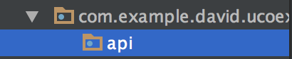

# Usando una API externa

Una API es una Interfaz de Programación de Aplicaciones (Application Programming Interface). Básicamente, una API es un servidor que gracias a unos métodos en su código, nos va a proveer de datos para nuestro uso.

En nuestro caso, y debido a su simplicidad, vamos a hacer una aplicación que pida datos a una API sobre perros, con la que montaremos un listado y un perfil para el perro.

Nuestra API es [dogapi](https://dog.ceo/dog-api/).

## Conexión con la API

Para empezar, debemos añadir las dependencias de [Retrofit](http://square.github.io/retrofit/), que es la librería que vamos a usar para la conexión con nuestra API. Retrofit es un cliente HTTP hecho para Java y Android.

***build.gradle (Module: app)***
```Java
  compile "com.squareup.retrofit2:retrofit:2.3.0"
  compile "com.squareup.retrofit2:converter-gson:2.3.0"
```
Cuando introducimos código en Gradle, tenemos que volver a sincronizar el código para que los cambios sean efectivos.

Ahora creamos un nuevo Package llamado API.



## Antes de Retrofit

Tenemos que crear nuestro modelo de datos, que nos servirá para recoger la información del servidor.

Creamos un Package llamado entities y dentro de él un archivo BreedWrapper.java

```java
public class BreedWrapper {
    @SerializedName("message")
    private List<String> breeds;
}
```

## Configurando Retrofit

Cuando trabajamos con Retrofit, debemos tener dos archivos básicos. Uno de ellos es una interfaz donde definiremos todos los métodos que usaremos para conectarnos a la API (por ejemplo traer todas las razas de perros o información acerca de una).

El otro es el cliente, que nos servirá para configurar nuestra conexión con la API y todo lo que le queramos añadir a Retrofit (por ejemplo un Interceptor). Aquí también instanciamos la interfaz para que podamos usar los métodos en nuestro código.

Creamos nuestra interfaz. La vamos a llamar **DogService.java**.

```java
public interface DogService {
    @GET("breeds/list")
    Call<BreedWrapper> getBreeds();
}
```

Ahora vamos a crear el cliente, ***DogClient.java***

```java
public class DogClient {
    private Retrofit retrofit;
    private final static String BASE_URL = "https://dog.ceo/api/";

    public DogClient(){
        this.retrofit = new Retrofit.Builder()
                .baseUrl(BASE_URL)
                .addConverterFactory(GsonConverterFactory.create())
                .build();
    }

    public DogService getDogService(){
        return this.retrofit.create(DogService.class);
    }
}
```
Con DogService.java estamos creando un "puente" entre nuestra app y la API. Cuando queramos traer todas las razas de perro, solamente tendremos que instanciar esa interfaz y usar el método.

El cliente, nos sirve para hacer la conexión. Tenemos la url básica de la api `https://dog.ceo/api/`
