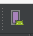

# Creación de un proyecto

Abrimos Android Studio y pulsamos en **Start a new Android Studio project**

Introducimos el nombre de nuestro proyecto, en nuestro caso **UCOExample**

Ahora tenemos que elegir el SDK mínimo con el que vamos a desarrollar la app. En nuestro caso vamos a usar **19**, que es soportada por el 90,1% de los dispositivos actualmente.

Cómo vamos a hacer una app móvil, sólo tenemos que marcar la opción de **Phone and Tablet**.

Android Studio nos proponer ahora una serie de actividades iniciales. Podemos elegir varias, cómo por ejemplo una con un **FAB** (Floating Action Button), una con una barra de navegación inferior, o incluso una actividad con mapa. Por experiencia, es más recomendable usar una actividad vacía y así controlamos el código que vamos generando.

En nuestro caso y cómo vamos a hacer una aplicación desde cero, elegimos **Empty Activity**.

Por último, ahora nos toca ponerle un nombre a la actividad, dejaremos el que viene por defecto ya que si en cualquier momento nos hace falta cambiarlo podemos hacerlo con la opción de **Refactor** que incluye el IDE.

Tenemos que tener en cuenta antes de finalizar, que queremos que AS nos genere el archivo de layout correspondiente a la actividad. Dependiendo del nombre que le demos cogerá el nombre y le añadirá activity.

Una vez hayamos escrito el nombre que queramos que tenga nuestro layout, pulsamos en **Aceptar** y AS empezará a generar nuestro proyecto.

Una vez que AS termine de indexar todo el proyecto, ya podemos comenzar.

# Lanzar la aplicación

Para lanzar la aplicación, lo primero que debemos hacer es comprobar esta parte de Android Studio.

 

En orden, los tres botones coloreados son:

  * Lanzar la aplicación en el emulador.
  * Lanzar la aplicación en modo debug.
  * AVD Manager.

# Configurar el emulador

Si no tenemos un emulador configurado, pulsamos primero en el botón de **AVD Manager**.

Nos aparecerá una ventana con el listado de emuladores instalados en nuestro sistema.

Para crear uno, pulsamos el botón de **Create Virtual Device** situado abajo a la izquierda.

Ahora nos saldrá una ventana con un listado de móviles y tablets que podemos elegir para emular. En nuestro caso vamos a crear un emulador para un **Google Pixel XL**.

Pulsamos en **Next** y ahora hay que elegir el sistema operativo del móvil. En nuestro caso vamos a elegir Marshmallow (Android 6.0). Por último elegimos el nombre de nuestro emulador y AS nos informa de los datos del mismo.

Una vez creado el emulador, sólo tenemos que pulsar en el botón de lanzar la app, elegir el móvil al que queremos lanzar la aplicación y esperar a que arranque.

