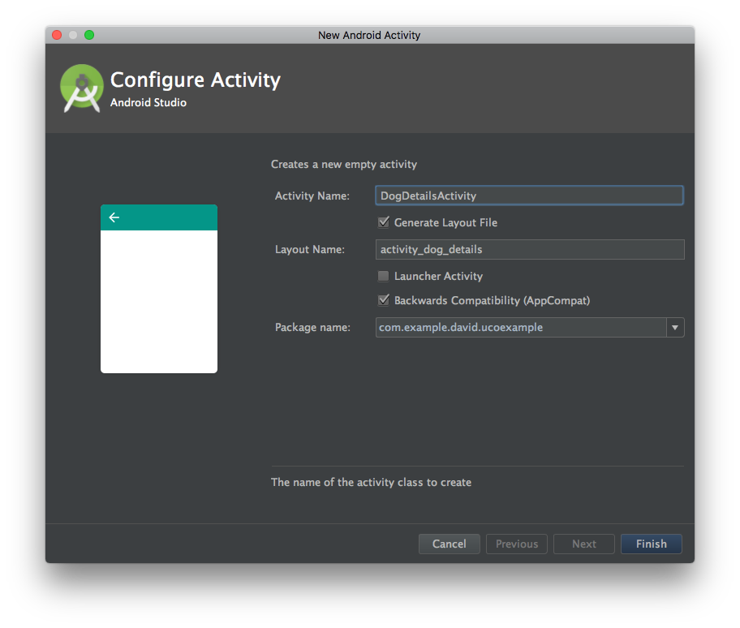

# Abrir una nueva actividad
## Primeros pasos

Para crear la actividad pulsamos sobre el package de nuestra app, click derecho, New -> Activity -> Empty Activity. Le ponemos como nombre **DogDetailsActivity**.



Hemos marcado las opciones de que nos cree un layout propio para actividad y que sea retrocompatible con otras versiones de Android.

***
### Nota
Cuando agregamos una actividad, esta se debe de dar de alta en el **AndroidManifest.xml**. Al crearla de la forma indicada Android Studio lo hará por nosotros, pero si lo hacemos nosotros a mano tenemos que tenerlo en cuenta.
***

Ya que nuestra app tiene un listado de items, ahora el siguiente paso es hacer que al pulsar en uno de ellos el item nos diriga a una pantalla donde nos de más información de la raza elegida.

Primero, vamos a crear una interfaz llamada **onClickOnItem**.

### ¿Por qué usamos interfaces?

Las interfaces sirven como contratos para que una clase implemente ciertas funciones. Nos sirve para definir como interactuar con las clases en caso de que hagamos una librería o pueden servirnos para ordenar nuestro propio código, ya que obligamos a que nuestra clase cumpla una determinada especificación de requisitos.

Una interfaz simplemente lista funciones, que a su vez serán implementadas por una clase. Hay que tener cuidado y hacer las interfaces lo más básicas posibles, ya que sino podemos tener funciones vacías en nuestra clase que no nos sirven para nada (violación del Principio de Liskov).

En nuestra interfaz, vamos a definir un método llamado **onClickBreed()**

```Java
public interface OnClickOnItem {
    public void onClickBreed();
}
```
***
### Nota

Podemos llamar a nuestra interfaz como queramos, incluso OnClick, pero para evitar que haya equivocación con la OnClick de Butterknife elegimos OnClickOnItem.
***

Cuando vamos a setear un evento de click, tenemos que cumplir dos pasos:

* Hay que declarar el evento **onClickListener** en el layout que queremos pulsar.
* Hay que implementar el método de click (en nuestro caso **onClickBreed**) en la actividad, adapter o fragment correspondiente.

## Asignando el evento

Nos vamos a nuestro adapter, y declaramos el siguiente método dentro de nuestro ViewHolder:

```Java
public void setOnClickListener(final OnClickOnItem onClick){
    itemView.setOnClickListener(new View.OnClickListener() {
        @Override
        public void onClick(View view) {
            onClick.onClickBreed();
        }
    });
}
```

Nuestra variable **itemView** es nuestra vista completa, es decir, toda la vista que engloba al CardView y los elementos que van dentro. Lo hacemos así para que, pulsemos donde pulsemos, el evento se dispare. Podemos tener un evento distinto para cada item de la CardView si queremos, pero no es el caso.

Ahora, para que el adapter llame a la actividad, primero debe recibir por constructor una instancia de la clase que implementa este interface **OnClickOnItem**.

Para ello, vamos a nuestro adaptador y añadimos un parámetro OnClickOnItem:

```Java
private OnClickOnItem onClick;

public DogListAdapter(OnClickOnItem onClick) {
    ...
    this.onClick = onClick;
}
```

Por último en nuestro adaptador, vamos al método **onBindViewHolder** y seteamos el evento de esta manera:

```Java
@Override
public void onBindViewHolder(ViewHolder holder, int position) {
    ...
    holder.setOnClickListener(onClick);
}
```

Con esto, ya enlazamos la función de onClick que vamos a implementar en la actividad con el item.

## Asignando el evento en la actividad

Una vez que el item dispare el evento, acto seguido se dispará la función en la actividad.

Si abrimos el archivo de MainActivity.java, vamos a notar que tenemos un error a la hora de declarar el adaptador. Eso es porque no estamos pasando una instancia de la interfaz.

Para arreglarlo, primero la actividad tiene que implementar la interfaz.

```Java
public class MainActivity extends AppCompatActivity implements OnClickOnItem{

}
```

Ahora, veremos como se subraya de rojo. Eso es debido a que estamos implementando una intefaz pero no hemos declarado la función que nos obliga a implementar (contrato de la interfaz). Escribimos la función o hacemos que AS nos la genere (Alt + Enter).

Ahora que ya tenemos la función, podemos pasar una instancia de la intefaz.

***
### Nota

Una vez que la clase implementa una intefaz, podemos pasar la instancia de la interfaz a otras clases usando el objeto **this** (Programación orientada a objetos). Básicamente, cuando implementamos una interfaz, toda su implementación se suma a la clase.
***

Ahora, pasamos la instancia al adaptador:

```Java
private void setAdapter() {
    adapter = new DogListAdapter(this);
}
```

Por último, abrimos la nueva actividad. Para ello debemos trabajar con los intents.

## ¿Qué es un intent?

Según la [documentación de Android](https://developer.android.com/guide/components/intents-filters.html), un intent es ***un objeto de acción que puedes usar para solicitar una acción de otro componente de la aplicación*** . Hay dos tipos de Intents:

* Explícitos: especifican que componente queremos abrir según su nombre (nombre de clase). Las usamos para abrir nuevas actividades de nuestra aplicación.
* Implícitos: aquí no se especifica qué componente vamos a abrir pero declara una acción general a realizar. Por ejemplo el abrir un mapa o el compartir algo por una red social.

### Declarando nuestro intent para abrir otra actividad

Nos vamos a nuestra función **onClickBreed()** y añadimos el siguiente código:

```Java
@Override
public void onClickBreed() {
    Intent intent = new Intent(this, DogDetailsActivity.class);
    startActivity(intent);
}
```

Ahora si probamos la app podremos abrir la nueva actividad.

***
### Extra
Como curiosidad, si vamos a nuestro AndroidManifest.xml y añadimos la siguiente propiedad a nuestra nueva actividad nos aparecerá la flecha para ir hacia atrás.

```xml
android:parentActivityName=".MainActivity"
```
***
