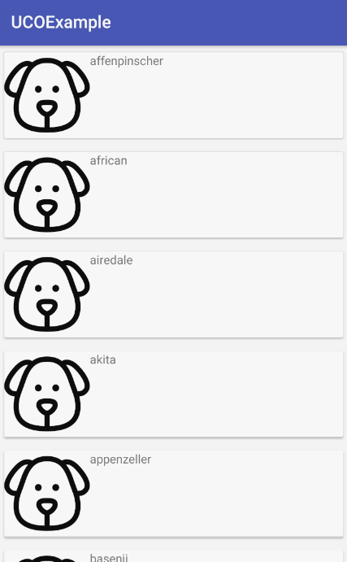

# Haciendo una petición al servidor

Vamos a nuestra actividad, y vamos a comenzar a traer datos de la api. Para empezar, debemos asignar un objeto de cliente Retrofit que hemos creado en anteriores pasos:

```Java
  private DogClient client;
```

Vamos a crear un constructor, donde vamos a instanciar el objeto:

```Java
public MainActivity() {
    client = new DogClient();
}
```

Y ahora en nuestro método **getDogBreeds** hacemos la petición con Retrofit:

```Java
private void getDogBreeds() {
    client.getDogService().getBreeds().enqueue(new Callback<BreedWrapper>() {
        @Override
        public void onResponse(Call<BreedWrapper> call, Response<BreedWrapper> response) {

        }

        @Override
        public void onFailure(Call<BreedWrapper> call, Throwable t) {

        }
    });
}
```

Como se puede ver, tenemos dos métodos internos. Uno es **onResponse** que se dispará cuando la llamada sea éxito (da igual si el código HTTP es 200 o 404) y la otra cuando falle por alguna razón como que la url no es válida o no tenemos red.

Ahora vamos a nuestro método **onCreate()** y añadimos la llamada a nuestro método:

```Java
@Override
protected void onCreate(Bundle savedInstanceState) {
    super.onCreate(savedInstanceState);
    setContentView(R.layout.activity_main);
    ButterKnife.bind(this);

    getDogBreeds();
}
```

Cuando lo tengamos, lanzamos la app en nuestro dispositivo o simulador.

## Ups!

Tenemos un fallo! Cuando vamos a realizar según que acciones, tenemos que habilitar permisos o hacer que el usuario nos habilite. En este caso, nos falta el permiso de red, así que para poder habilitarlo vamos a nuestro **AndroidManifest.xml** y añadimos la siguiente línea justo encima del tag <application>.

```xml
<uses-permission android:name="android.permission.INTERNET" />
```

Si ahora volvemos a lanzar la app, ya no nos dará el fallo.

## Rellenando el RecyclerView

Primero, debemos declarar el objeto del adapter:

```Java
  private DogListAdapter adapter;
```

Y lo instanciamos en el método de **setAdapter**

```Java
private void setAdapter() {
    adapter = new DogListAdapter();
}
```

También tenemos que instanciar el RecyclerView:

```Java
private void setRecyclerView() {
    dogList.setLayoutManager(new LinearLayoutManager(this));
    dogList.setAdapter(adapter);
}
```

Hay dos parámetros básicos:

* **Layout Manager**: básicamente es como el RecyclerView va a mostrar los datos. En nuestro caso queremos un listado linear (por defecto es vertical), pero puede ser un GridLayout o incluso en varias columnas.

* **Adaptador**: es el adaptador que le va a proveer los datos para mostrar.

Por último, queda añadir en el **onResponse** lo que queremos hacer:

```Java
@Override
public void onResponse(Call<BreedWrapper> call, Response<BreedWrapper> response) {
    adapter.setDogBreeds(response.body().getBreeds());
}
```

Si lanzamos la app nos debe de salir una primera versión de nuestro listado.


