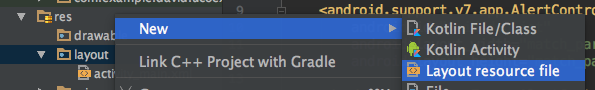
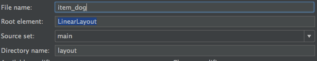

# Organizar la vista
## Como organizar nuestra vista

Antes de comenzar, debemos saber como están organizadas las vistas en Android.

Para crear una vista, debemos editar el archivo **activity_main.xml** que nos creó *Android Studio* cuando creamos nuestro proyecto. Cada actividad o fragmento tienen que tener una vista asociada. Cuando la aplicación corre nuestra clase *Java*, infla la vista y la muestra al usuario. También podemos crear los objetos de nuestra vista desde la clase Java que infla el layout.

Hay distintas formas de organizar nuestro layout. Android cuenta con una serie de contenedores que agrupará en contenido, y en ellos será donde coloquemos nuestros elementos de **UI** (*User Interface*).

Podemos tener un diseño linar (**LinearLayout**) que colocará los elementos uno detrás de otro, bien de forma horizontal o de forma vertical. Podemos organizar nuestros elementos como en una tabla o grid (Google Fotos) con **GridLayout** o **TableLayout**. Hay layouts especiales para mostrar un fragment (**FrameLayout**). Por último, podemos colocar nuestros elementos de forma relativa, algo así como se hace en web, con **RelativeLayout**.


## Listado de razas de perro

Una vez abramos nuestro activity_main.xml veremos que tenemos un ConstraintLayout y dentro de él un TextView con un texto de ejemplo.

Como no vamos a usar nada de constraints, cambiamos este por un LinearLayout, borramos el TextView y añadimos un RecyclerView.

Si miramos en la preview, nos dará un aviso de que nos falta la dependencia de RecyclerView, así que vamos al build.gradle de app y añadimos la siguiente línea:

```Java
compile "com.android.support:recyclerview-v7:25.3.1"
```
***
### Nota

Cuando añadimos una librería a Gradle, la dependencia viene dividida en 3 partes divididas por `:`. La estructura de una dependencia es `nombre-librería:item-librería:version`. Cuando trabajemos con una misma librería e importemos cosas distintas, tenemos que tener cuidado de que hay que importar la misma versión para todas.
***

El código de nuestra vista puede ser así:

```xml
<?xml version="1.0" encoding="utf-8"?>
<LinearLayout xmlns:android="http://schemas.android.com/apk/res/android"
    xmlns:app="http://schemas.android.com/apk/res-auto"
    xmlns:tools="http://schemas.android.com/tools"
    android:layout_width="match_parent"
    android:layout_height="match_parent"
    tools:context="com.example.david.ucoexample.MainActivity">

  <android.support.v7.widget.RecyclerView
       android:id="@+id/dogList"
       android:layout_width="match_parent"
       android:layout_height="match_parent">

  </android.support.v7.widget.RecyclerView>

</LinearLayout>
```

## Crear item de perro

Una vez que tenemos configurado el contenedor del listado, ahora tenemos que crear los items que vamos a mostrar. Como quedan muy curiosos, vamos a hacer CardViews, que son tarjetas implementadas por Android con la librería de [Material Design](https://material.io/guidelines/).

Para crear un nuevo layout, hacemos click derecho sobre **res/layout** y vamos a **New/Layout resource file**.
Como nombre le pondremos **item_dog**. En cuant a nomemclatura, en Android se suele poner primero si es item o algún tipo de vista (activity, fragment) seguido de una barra baja y un nombre identificativo.




Una vez tengramos creado nuestro layout, es hora de implementar nuestra primera CardView. Una card de Material es una hora que sirve como punto de entrada a información. En nuestro caso lo vamos a usar para listar razas de perro, que aunque es un listado sencillo y sólo tendremos el nombre de la raza, vamos a intentar que destaque de alguna manera.

Antes de nada, hay que ir a añadir su dependencia:

```Java
compile "com.android.support:cardview-v7:25.3.1"
```

Una vez añadida, la estructura básica de nuestro layout sería:

```xml
<?xml version="1.0" encoding="utf-8"?>
<android.support.v7.widget.CardView
    xmlns:android="http://schemas.android.com/apk/res/android"
    android:layout_margin="8dp"
    android:layout_width="match_parent"
    android:layout_height="100dp">

    <LinearLayout
        android:orientation="horizontal"
        android:layout_width="match_parent"
        android:layout_height="match_parent">

        <ImageView
            android:src="@drawable/dog"
            android:layout_width="100dp"
            android:layout_height="match_parent" />

        <TextView
            android:id="@+id/dogBreedName"
            android:layout_width="wrap_content"
            android:layout_height="wrap_content" />

    </LinearLayout>
</android.support.v7.widget.CardView>
```

Como puedes ver, hemos puesto una CardView que a fin de cuentas es un contenedor del contenido interior. Dentro tenemos un LinearLayout horizontal, que tendrá dos items, una imagen y un texto.

Para la imagen vamos a usar una estática


Debemos añadir la imagen en **res/drawable** y le ponemos el nombre **dog.png**.
